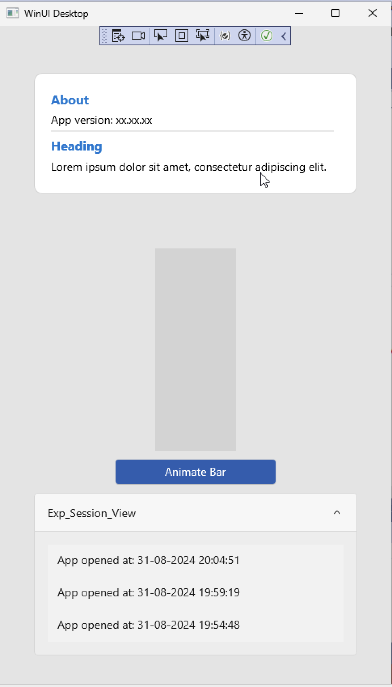
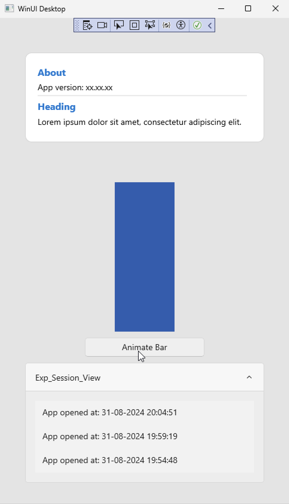

# WindowApp
Window app developed using WIndow app SDK and WinUI3
## Overview

The Assessment consists of the following section:
- **Section 1:** Implemented an about section, tried to follow the color and size theme of the design mockup.
- **Section 2:** Implemented the animation on button click. When the user clicks the button the blue bar animates up and when the button is clicked again it animates down.
  - The long press and hold solution code is implemented but the event was not firing, so added a button click animation as a workaround.
- **Section 3:** The app logs the date and time when it is initialized and stored inside a .txt file in the user AppData folder. This data is then accessed and displayed in this section

### Video Demonstration

A video is included inside AssessmentImages folder, feel free to have a look.
